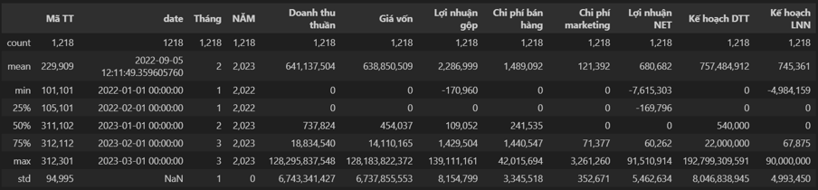
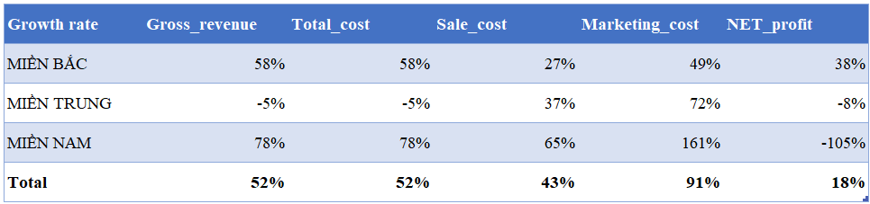
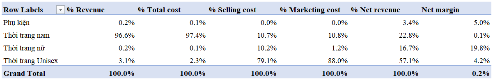
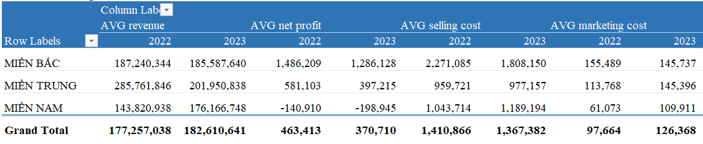

# Project: Store Performance Analysis Across Northern, Central, and Southern Regions

## Project Background
This project aims to analyze the operational and financial performance of a retail brand's stores across three regions (Northern, Central, and Southern) in Vietnam during Q1 2022 and Q1 2023. The analysis leverages key financial metrics, including Net Revenue, Gross Profit, and Selling Expenses, to provide actionable insights into regional performance and overall business efficiency.

### Key Objectives
1. **Evaluate regional performance:** Compare revenue, profit, and expense trends across the Northern, Central, and Southern regions.
2. **Identify operational inefficiencies:** Highlight areas where costs are disproportionately high relative to revenue.
3. **Develop actionable recommendations:** Provide strategies to optimize costs and enhance profitability for each region.

---

## Data Overview
The dataset includes daily performance data for individual stores, with the following fields:

- The data shows a right-skewed distribution.
- The largest values of Net Revenue, Cost of Goods Sold, Selling Expenses, and NET Profit significantly exceed the mean and the 75th percentile -> Outliers.
- The level of selling and marketing expenses is relatively high compared to gross profit, putting pressure on NET profit.
- Some negative values in Gross Profit and NET Profit indicate that certain stores are struggling to cover their costs.
- In both years, net revenue and net profit did not meet the set targets

### Data Preparation
- Removed outliers (e.g., store 101101 in Hanoi) to avoid skewed analysis.
- Aggregated data to analyze quarterly trends.

---

## Executive Summary
### Key Findings

1. **Overall Growth:** Gross revenue and total costs increased by 52% year-over-year. However, cost increases (e.g., 91% rise in marketing expenses in the Southern region) outpaced revenue growth in some areas, pressuring profitability.
2. **Regional Insights:**
   - **Northern Region:** Efficient cost control, steady growth, but declining profitability.
   - **Central Region:** Severe revenue decline (-29.3%) with rising costs, leading to minimal profitability.
   - **Southern Region:** Significant revenue growth (+22.5%) but negative profit (-105%) due to high marketing and selling expenses.

3. **Product Category Performance:**
   - Men's fashion drives revenue but suffers from high costs.
   - Women's fashion and accessories offer higher profit margins with low cost-to-revenue ratios.
   - Unisex fashion shows potential but requires cost optimization.

---

## Detailed Insights

### Northern Region
- **Revenue:** Declined slightly (-0.88%), reflecting good customer retention.
- **Profitability:** Net profit dropped by 13.5% due to operational inefficiencies.
- **Recommendations:**
  - Maintain cost control measures.
  - Experiment with targeted marketing strategies to boost revenue.

### Central Region
- **Revenue:** Decreased sharply by 29.3%, the largest decline across regions.
- **Costs:** Marketing expenses rose by 27.8%, but campaigns were ineffective.
- **Recommendations:**
  - Reassess marketing strategies.
  - Tighten control over selling expenses.

### Southern Region
- **Revenue:** Increased significantly by 22.5%, indicating high market potential.
- **Profitability:** Negative profit worsened by 41% due to disproportionate cost growth.
- **Recommendations:**
  - Optimize marketing and operational costs.
  - Evaluate ROI for all promotional campaigns.

---

## Recommendations
1. **Northern Region:**
   - Continue optimizing selling and marketing expenses.
   - Focus on innovative marketing to drive revenue.

2. **Central Region:**
   - Cut ineffective marketing campaigns.
   - Identify and invest in high-potential segments to regain market share.

3. **Southern Region:**
   - Review and optimize all operational processes.
   - Eliminate low-ROI marketing efforts to improve net profitability.

---

## Assumptions and Caveats
- Missing or inconsistent data for certain stores was excluded from the analysis.
- Negative profits in some regions are assumed to result from high marketing expenses without considering potential external market factors.

---

## How to Use the Repository
1. **Code and Queries:** Contains SQL scripts for data cleaning, aggregation, and analysis.
2. **Visualization Tools:** Interactive dashboards for exploring sales trends.
3. **Documentation:** Detailed breakdown of insights and recommendations.

Feel free to explore the repository and provide feedback!

